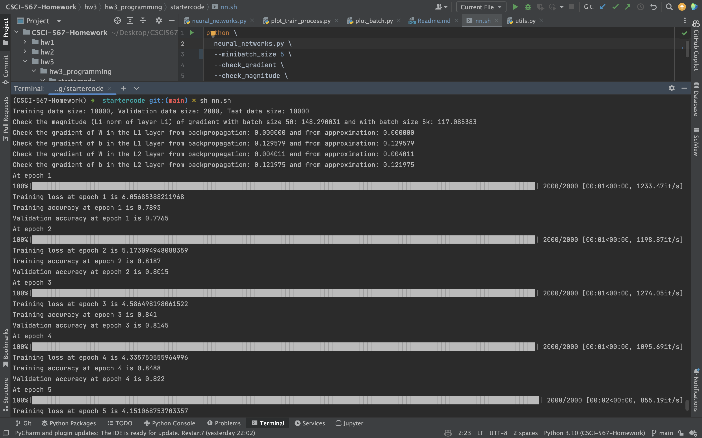
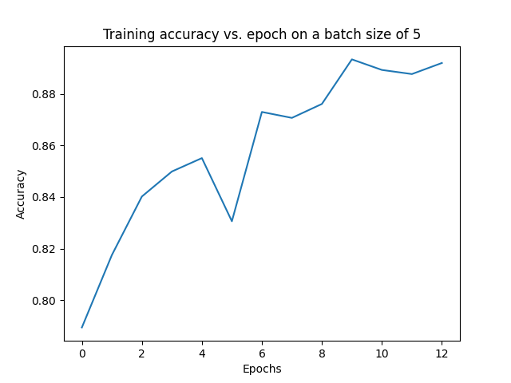
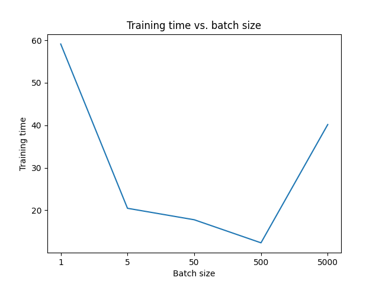

## Install Requirements:
```
    conda create -n CSCI-567-Homework
    pip install -r requirements.txt
```

## Question 3.1

### 3.1.5
code completion contained in `neural_networks.py`

### 3.1.6
Screenshot of the output log: 


Training Accuracy vs. epochs:


## Question 3.2

### 3.2.1
Training accuracy and training time w.r.t. batch size:


### 3.2.2

Number of training epochs required to get the best model for each batch size:  
batch_size = 1: best_epoch = 13  
batch_size = 5: best_epoch = 10  
batch_size = 50: best_epoch = 43  
batch_size = 500: best_epoch = 39  
batch_size = 5000: best_epoch = 158  

**(Not sure)**  
Number of gradient updates to get the best model for each batch size:  
= training_data_size(10000)/mini_batch_size * num_epochs

batch_size = 1: best_epoch = 10000/1 * 13 = 130000  
batch_size = 5: best_epoch = 10000/5 * 10 = 20000  
batch_size = 50: best_epoch = 10000/50 * 43 = 8600  
batch_size = 500: best_epoch = 10000/500 * 39 = 780  
batch_size = 5000: best_epoch = 10000/5000 * 158 = 316  

### 3.2.3
(i). Smaller batch size does not guarantee faster training, because it needs more gradient updates

(ii). Larger batch cannot imply higher test accuracy

| batch_size | test_accuracy |
|:----------:|:-------------:|
|     1      |    0.8482     |
|     5      |    0.8435     |
|     50     |    0.8292     |
|    500     |     0.751     |
|    5000    |    0.6856     |

**(reason idk)**

This is because larger batch size makes it updates less often, therefore converge slower and requires more epoches.

(iii). Larger batch size imply less gradient updates to converge.

**(reason?)**

This is because when batch size is larger, number of gradient updates are smaller in each epoch. 
Even though it will require more epoches, but the overall number of gradient updates is smaller.

## Question 3.3

### 


